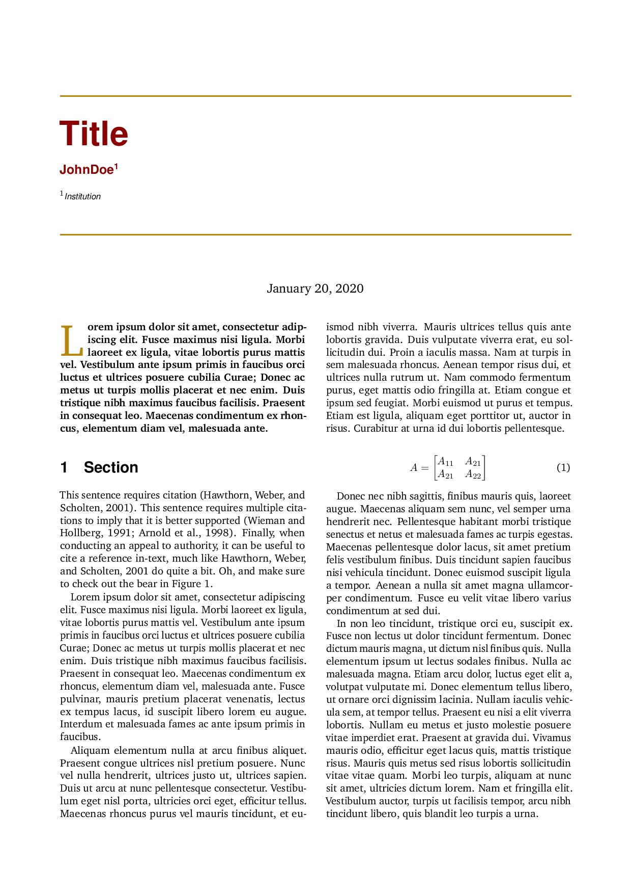
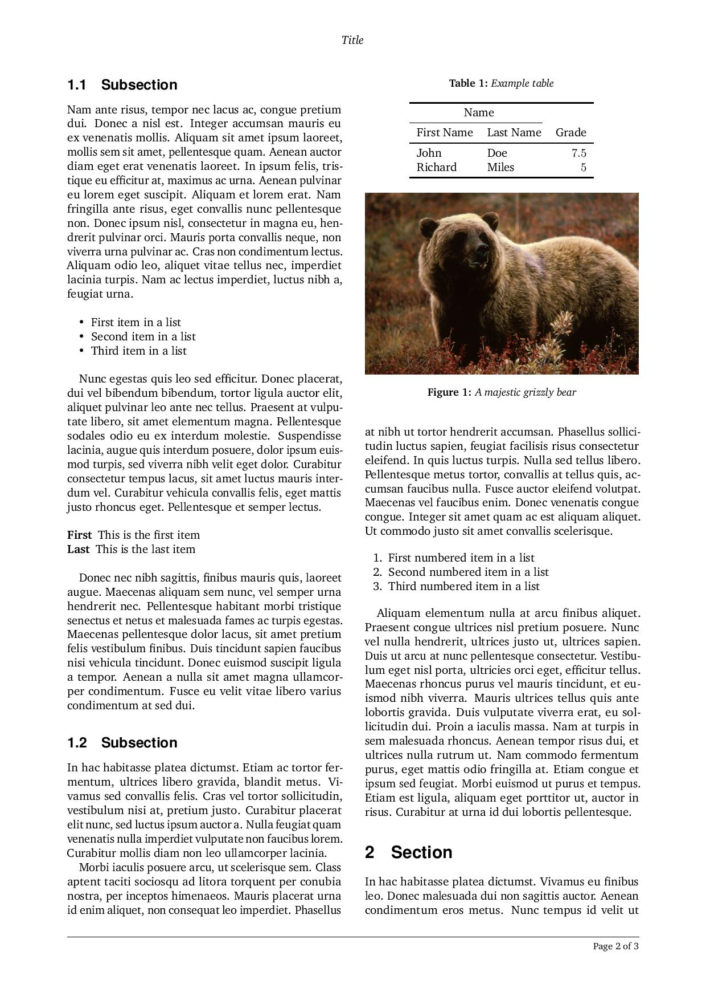
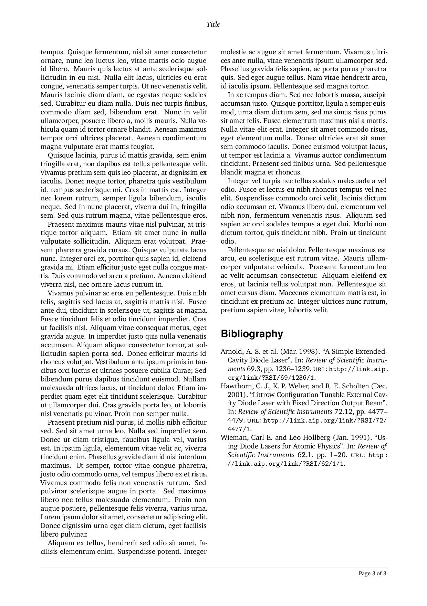

# cookiecutter-latex-wenneker-article

A template for writing LaTeX documents.
See https://github.com/audreyr/cookiecutter.
This template produce the template "Wenneker Article" from http://www.LaTeXTemplates.com.

* Pretty Title Page: fields are automatically populated at project creation.
* BibTeX: Set up to use BibTeX.
* Standard directory structure.

See [Output](#output) for screenshots

## Usage

Install *cookiecutter*:

    pip install cookiecutter

Generate a LaTeX project:

    cookiecutter https://github.com/tgrandjean/cookiecutter-latex-article

Start writing your document!

  You just have to edit content.tex and abstract.tex (if you have selected an abstract)

## Not Exactly What You Want?

### Similar Cookiecutter Templates

[Original template](https://github.com/selimb/cookiecutter-latex-article)

### Fork This and Create Your Own

If you have differences in your preferred setup, I encourage you to fork this and make the desired modifications.

* Once you have your own version working, add it to the Similar Cookiecutter
  Templates list above with a brief description.

* It's up to you whether or not to rename your fork/own version. Do whatever
  you think sounds good.

### Pull Request

I accept suggestions/pull requests.

# Output

**Screenshots:**

